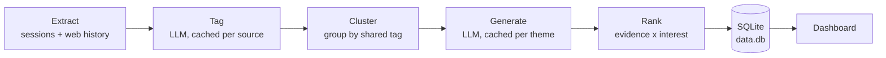

<div align="center">
<br>
<h1>Echoes of the Week</h1>


<br>


</div>
<br>

A private, local-first dashboard that turns the past seven days of your
Claude Code and Codex sessions plus browsing history into grounded ideas for blog and LinkedIn posts.
It groups related activity, ranks ideas by evidence and reader interest, and keeps everything
in a local SQLite database.

## Features

- Reads Claude Code sessions, interactive Codex sessions, and browser history from local files
- Clusters related activity into themes
- Generates long-form and short-form post ideas with DeepSeek
- Ranks ideas by evidence strength and predicted reader interest
- Asks for missing personal context when an idea needs it
- Supports favorites, filters, dismissals, and a date-based archive
- Caches tags and themes to avoid repeat model calls



## Requirements

- Node.js 20 or newer
- A DeepSeek API key
- At least one supported local activity source

## Setup

```bash
npm install
cp .env.example .env
cp config/browsers.example.json config/browsers.json
```

Add your `DEEPSEEK_API_KEY` to `.env`, then update `config/browsers.json` with the browser
profiles you want to read. Both files are ignored by Git.

## Run

```bash
npm run generate
npm run dev
```

Open [http://localhost:3000](http://localhost:3000). You can also run the same pipeline from
the dashboard with **Generate today's ideas**.

## Browser history sources

Echoes reads browser databases directly and never modifies them. Supported engines are:

| Engine | Browsers | File |
| --- | --- | --- |
| `chromium` | Chrome, Dia, Brave, Edge, Arc | `History` |
| `firefox` | Firefox, Zen | `places.sqlite` |
| `json` | Legacy exported history | `history.json` |

Example:

```json
{
  "sources": [
    {
      "name": "Chrome",
      "engine": "chromium",
      "path": "~/Library/Application Support/Google/Chrome/Default/History",
      "enabled": true
    }
  ]
}
```

Paths support `~` and `$HOME`. Missing or inaccessible sources are skipped with a warning so
the rest of the pipeline can continue.

## Session sources

Claude Code sessions are read from `~/.claude/projects`. Interactive Codex sessions are read
from dated rollouts in `~/.codex/sessions`, archived rollouts in
`~/.codex/archived_sessions`, and optional titles in `~/.codex/session_index.jsonl`.
Override these roots with `CLAUDE_PROJECTS_DIR` and `CODEX_HOME`. Missing, unreadable, or
malformed Codex data is skipped because its local JSONL format is not a documented public API.

## Configuration

Copy `.env.example` to `.env` for the full list of settings. The main options are
`DEEPSEEK_API_KEY`, `DEEPSEEK_BASE_URL`, `DEEPSEEK_MODEL`, `WINDOW_DAYS`,
`CLAUDE_PROJECTS_DIR`, `CODEX_HOME`, `DB_PATH`, `BROWSERS_CONFIG`, `GEN_TEMPERATURE`, and
`TAG_TEMPERATURE`.

## Local extensions

Echoes can load an optional trusted local extension without adding that extension to this
repository. Set `ECHOES_EXTENSION_PATH` in `.env.local` to the absolute path of an ESM module
that implements extension API v1. With no extension configured, the local-tools API and UI stay
disabled. See [`lib/extensions/types.ts`](lib/extensions/types.ts) for the versioned contract.

Local extensions run with the same operating-system permissions as Echoes. Only configure code
you trust.

## Privacy

Claude Code and Codex session data, browser history, generated ideas, API keys, and personal browser configuration
stay local and are excluded by `.gitignore`. Only selected activity summaries are sent to the
configured model API during tagging and idea generation.

## License

This project is licensed under the [MIT License](LICENSE).
